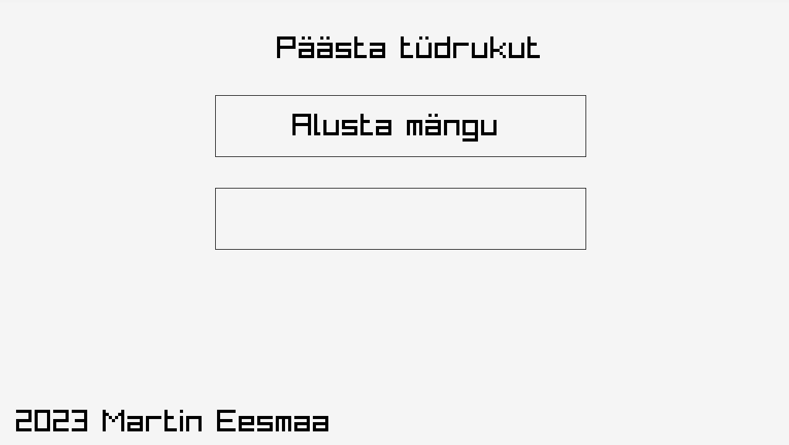
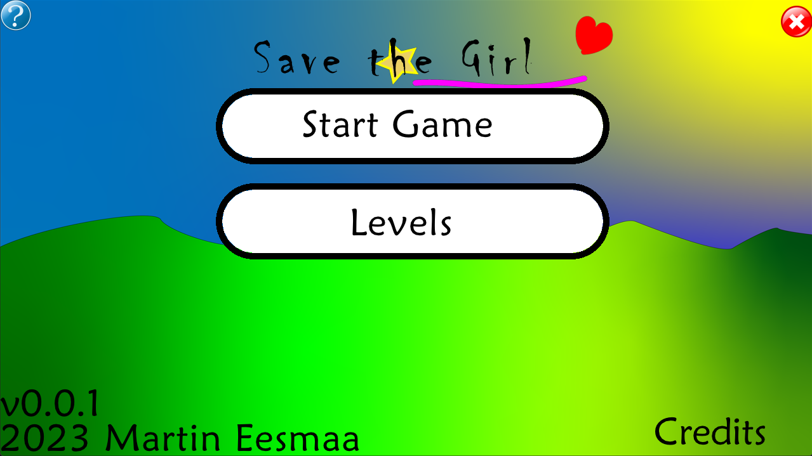
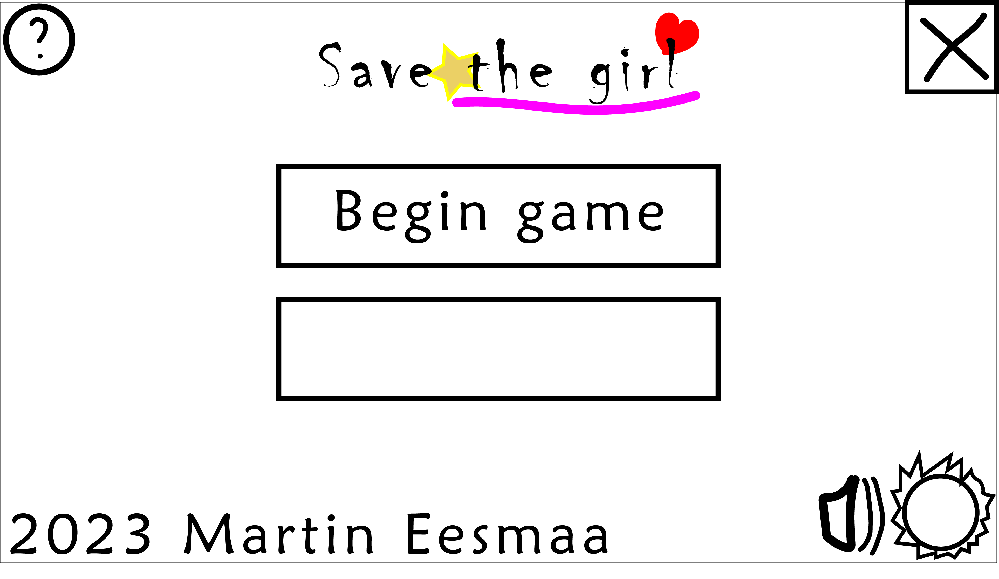
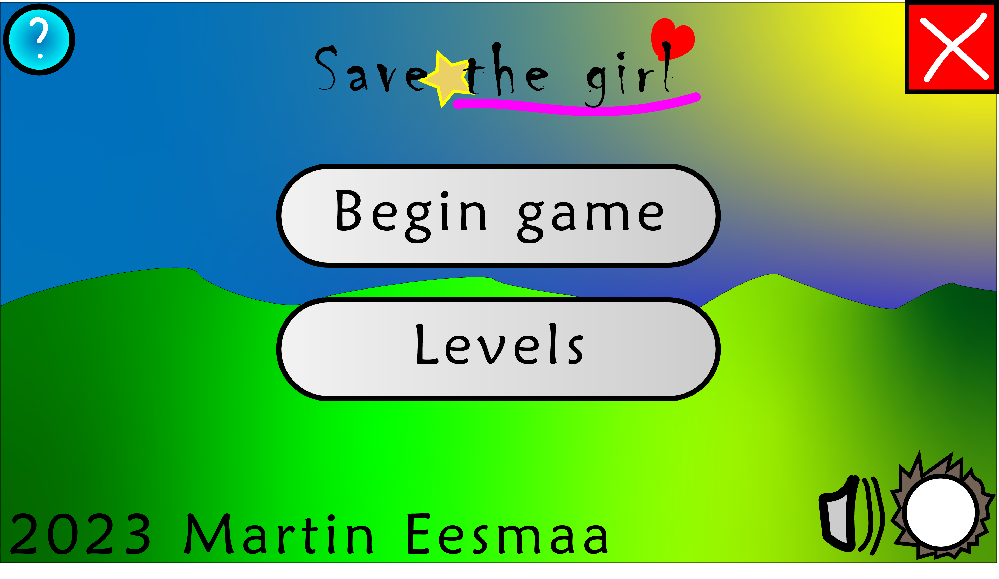

# Save the Girl (game)

Save the Girl game, made in Raylib with C++ code.

Before I start to build the game, I'm gonna use Raylib with C++ code to make game program.

## System requirements to play

System requirements:

Component | Minimum requirements
--- | ---
OS (operating system) | Windows XP and later, Mac OS, Linux, Android and other supported platforms.
RAM (memory) | 64 MB+
GPU (video graphics) | OpenGL 1.1+
Data | 32 MB+

## Example old screenshot from the game:

## Example new screenshot from the game:

## Design screenshot:

## Final design

## To build the game

If you want to build a game and play, you need have C++ compiler, like example GCC or Visual Studio and Raylib library and headers too. More information you can find out how to install Raylib to your computer: https://www.raylib.com/

## Story:

Once a upon time, princess sleeps her bed in morning, but one day... the enemies catched and kidnaps the princess away, put to the car and went far so on somewhere city...

## Functions:

Player

Items

Coins

Enemies

Princess

Bonus

Puzzle

Local multiplayer

Additional gamepad support

Scores

Own music

Languages

Settings

## Music and sound effects:

## Themes:

## Art:

Coming soon later...

- Martin Eesmaa