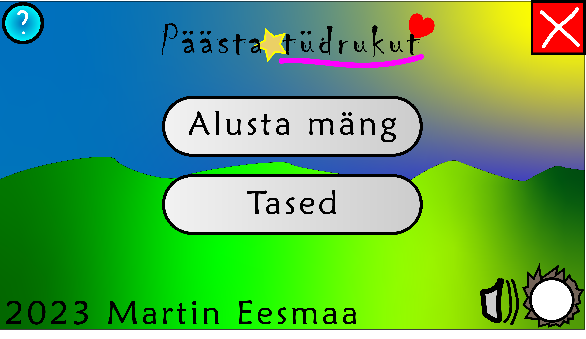

# Päästa Tüdrukut (mäng)

Päästa tüdrukut mäng, tehtud Raylib-is C++ koodi.

Enne kui ma hakkan ehitama mängu, ma kasutan Raylib koos C++ koodi teha mänguprogrammi rakendus.

## Näide ekraanpilt mängust:

## Kujundus ekraanpilt:

## Viimane kujundus

## Ehitada mängu

Kui tahad ehitada mängu ja mängida, sul on vaja ehitaja C++ programmi, näiteks GCC või Visual Stuudios ja Raylib raamatukogu ja päised ka. Lisateavet võid uurida kuidas installida Raylib arvutisse: https://www.raylib.com/

## Lugu:

Elas kord printsess magas tema voodis hommikul, aga üks päev… kuritegijad püüdis ja varastas printsess ära, pandi autosse ja läks kaugele nii edasi kusagil linna…

## Funktsioonid:

Mängija

Asjad

Mündid

Kuritegijad

Printsess

Boonus

Pusle

Kohalik multimängijad

Lisateenus mängu juhid

Punktid

Oma muusikad

Keeled

Sätted

## Muusika ja heliefektid:

## Taustad:

## Kunst:

Varsti tuleb hiljem...

- Martin Eesmaa